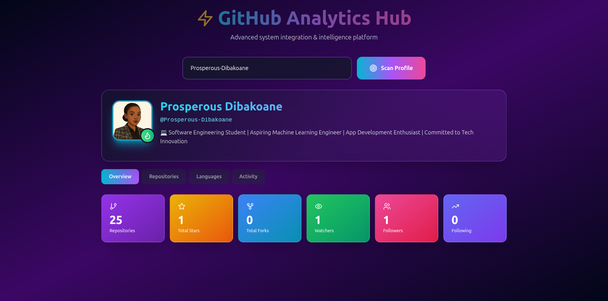

# GitHub Analytics Hub

A modern, beautiful React application for analyzing GitHub profiles with advanced metrics and visualizations.


## Features

- 🔍 **Profile Analysis** - Enter any GitHub username or profile URL
- 📊 **Advanced Statistics** - Track repositories, stars, forks, followers, and more
- 💻 **Language Distribution** - Visual breakdown of programming languages used
- 🎯 **Activity Metrics** - Monitor push events, pull requests, and issue activity
- 🎨 **Modern UI** - Beautiful gradient design with smooth animations
- 📱 **Responsive** - Works perfectly on desktop, tablet, and mobile

## Technologies Used

- **React 18** - Modern React with hooks
- **Vite** - Lightning-fast build tool
- **Tailwind CSS** - Utility-first CSS framework
- **Lucide React** - Beautiful icon library
- **GitHub API** - Real-time data from GitHub

## Installation

1. **Clone or download the project**

```bash
cd github-analytics-hub
```

2. **Install dependencies**

```bash
npm install
```

3. **Start the development server**

```bash
npm run dev
```

The app will open at `http://localhost:5173`

## Build for Production

```bash
npm run build
```

This creates an optimized production build in the `dist` folder.

## Preview Production Build

```bash
npm run preview
```

## Usage

1. Enter a GitHub username (e.g., `torvalds`) or paste a full profile URL
2. Click "Scan Profile" or press Enter
3. Explore the different tabs:
   - **Overview** - Key metrics at a glance
   - **Repositories** - Top 20 most recently updated repos
   - **Languages** - Programming language breakdown
   - **Activity** - Recent GitHub activity statistics

## Project Structure

```
github-analytics-hub/
├── src/
│   ├── App.jsx          # Main application component
│   ├── main.jsx         # React entry point
│   └── index.css        # Global styles with Tailwind
├── index.html           # HTML template
├── package.json         # Dependencies and scripts
├── vite.config.js       # Vite configuration
├── tailwind.config.js   # Tailwind configuration
├── postcss.config.js    # PostCSS configuration
└── README.md           # This file
```

## GitHub API Rate Limits

This app uses the GitHub API without authentication, which has a rate limit of 60 requests per hour per IP address. For higher limits, you can add authentication by modifying the fetch calls in `App.jsx`.

## Customization

- **Colors**: Modify the gradient colors in `App.jsx`
- **Styling**: Update Tailwind classes or add custom CSS in `index.css`
- **Features**: Add more API endpoints or data visualizations

## License

MIT License - Feel free to use this project for personal or commercial purposes.

## Contributing

Contributions are welcome! Feel free to submit issues or pull requests.

---


Built with ❤️ using React and Tailwind CSS
